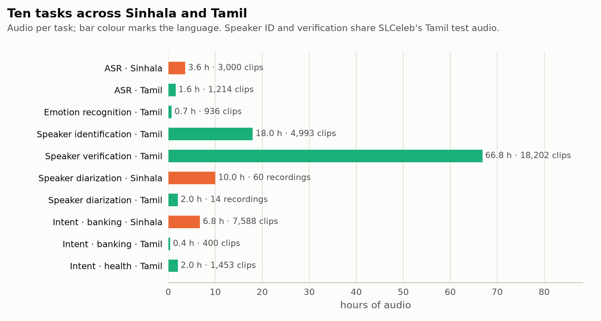
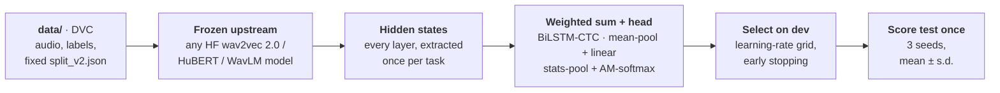
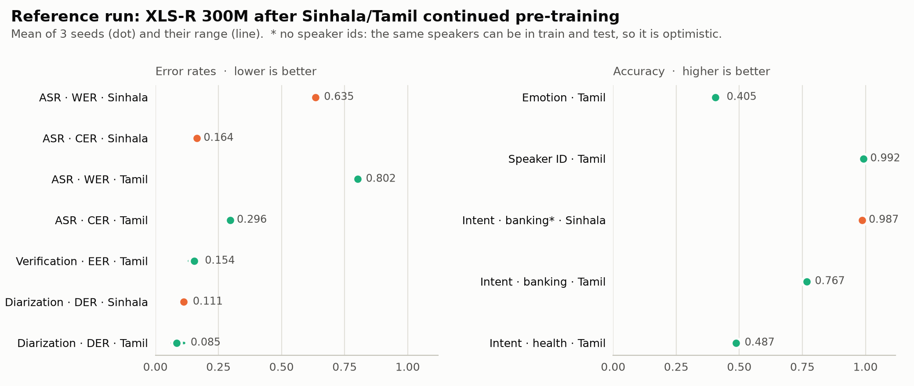

<div align="center">

# SLSB: Sinhala & Lankan-Tamil Speech Benchmark

**A frozen-upstream, SUPERB-style benchmark for self-supervised speech models on Sinhala and Sri Lankan Tamil.**<br>
Ten tasks across six families, leak-checked splits, standard downstream heads, and model selection on dev.

[](#installation)
[](#installation)
[](docs/protocol.md)
[](docs/data.md)
[](LICENSE)

[Tasks](#tasks) · [Protocol](#protocol) · [Reference results](#reference-results) · [Quick start](#quick-start) · [Repository layout](#repository-layout) · [Documentation](#documentation) · [Limitations](#limitations) · [Changelog](CHANGELOG.md) · [Citation](#citation) · [License](#license)

</div>

---

SLSB measures what a speech encoder's representations already know about Sinhala and Tamil.
The encoder (the *upstream*) is always frozen. For each task, only a learned weighted sum over
its layers and a small standard head are trained, chosen on a dev set and scored once on a
held-out test set. Any Hugging Face wav2vec 2.0, HuBERT or WavLM-style checkpoint, or a local
copy of one, can be benchmarked with a single command.

- **Ten tasks, six families:** speech recognition, emotion recognition, speaker
  identification, speaker verification, speaker diarization, and intent classification.
- **Splits that don't leak.** Every split is fixed data, disjoint by speaker or recording
  where the data allows, and checked automatically so that no identical audio appears in
  both training and test.
- **Standard heads, selected on dev.** SUPERB's downstream heads, with learning rate and
  stopping epoch chosen on a dev set. Each task runs with 3 seeds and reports mean ± s.d.
- **Every run is traceable.** Results go to a CSV table, a JSON summary and, optionally,
  MLflow on DagsHub, tagged with the protocol version and the hyperparameters each head
  settled on.

## Tasks

<picture>
  <source media="(prefers-color-scheme: dark)" srcset="docs/assets/fig1-tasks-dark.png">
  
</picture>

| Family | Task | Language | Data | Size | Speakers | Evaluation | Metric |
|---|---|---|---|---|---|---|---|
| Speech recognition | `asr_sinhala` | Sinhala | OpenSLR-52 | 3,000 clips · 3.6 h | 478 | speaker-disjoint train/dev/test | WER, CER |
| | `asr_tamil` | Tamil | TaLk | 1,214 clips · 1.6 h | 22 | speaker-disjoint train/dev/test | WER, CER |
| Emotion recognition | `er_tamil` | Tamil | EmoTa | 936 clips · 0.7 h | 22 | speaker-disjoint 5-fold CV | accuracy, macro-F1 |
| Speaker identification | `sid` | Tamil | SLCeleb | 4,993 clips · 18.0 h | 40 | closed set; test videos unseen in training | accuracy, macro-F1 |
| Speaker verification | `asv_tamil` | Tamil | SLCeleb | 18,202 clips · 66.8 h | 89 train · 40 test | 37,720 trials, unseen speakers | EER |
| Speaker diarization | `sd_sinhala` | Sinhala | SiTa | 60 recordings · 10.0 h | 1–10 per recording | recording-disjoint, 24/12/24 | DER |
| | `sd_tamil` | Tamil | SiTa | 14 recordings · 2.0 h | 2–6 per recording | recording-disjoint, 6/3/5 | DER |
| Intent classification | `ic_banking_sinhala` | Sinhala | banking intents | 7,588 clips · 6.8 h | not recorded | stratified train/dev/test | accuracy, macro-F1 |
| | `ic_banking_tamil` | Tamil | banking intents | 400 clips · 0.4 h | 40 | speaker-disjoint 5-fold CV | accuracy, macro-F1 |
| | `ic_health_tamil` | Tamil | health intents | 1,453 clips · 2.0 h | 100 | speaker-disjoint 5-fold CV | accuracy, macro-F1 |

Dataset sources, licences and per-task details are in **[docs/tasks.md](docs/tasks.md)**.
Three tasks in `data/` are not run, each for a data-quality reason; see
[Limitations](#limitations).

## Protocol



Every hidden state is layer-normed over its features before the weighted sum (since v0.3),
so layers with a large scale cannot dominate the mix regardless of what they encode.

| Task family | Downstream head | Selected on |
|---|---|---|
| ASR | weighted sum + 2-layer BiLSTM (1024 per direction) + CTC over characters, greedy decoding | dev CER |
| Emotion, speaker ID, intent | weighted sum + mean-pool + linear | dev accuracy |
| Speaker verification | weighted sum + mean/std statistics pooling + linear embedding, AM-softmax; cosine scoring | dev EER |
| Speaker diarization | the verification head, trained on single-speaker stretches; windows clustered per recording, number of speakers never given | dev DER |

The heads follow SUPERB, with two documented exceptions. Speaker verification uses
statistics pooling rather than an x-vector, because it was clearly better on dev with only
89 training speakers. Its layer mix is also fixed before training, because storing every
layer's frames for its 45 h of training audio would not fit on disk. Diarization takes
speech regions from the reference annotations, so it measures speaker discrimination
rather than speech detection.

The full protocol is in **[docs/protocol.md](docs/protocol.md)**: splits, model selection,
seeds, feature caching, hyperparameters and leakage checks.

## Reference results

<picture>
  <source media="(prefers-color-scheme: dark)" srcset="docs/assets/fig2-reference-results-dark.png">
  
</picture>

**XLS-R 300M after continued pre-training** on 200 h of Sinhala and Tamil
([Model-Training-Pipeline](https://github.com/EchoVerge-Labs/Model-Training-Pipeline),
checkpoint 9000), **v0.2 protocol**, 3 seeds. These predate v0.3's per-layer layer norm and
are not comparable with v0.3 scores; the reference model is being re-run under v0.3:

| Task | Language | Metric | Mean ± s.d. |
|---|---|---|---|
| ASR | Sinhala | WER ↓ / CER ↓ | 0.635 ± 0.008 / 0.164 ± 0.002 |
| ASR | Tamil | WER ↓ / CER ↓ | 0.802 ± 0.006 / 0.296 ± 0.002 |
| Emotion recognition | Tamil | accuracy ↑ / macro-F1 ↑ | 0.405 ± 0.018 / 0.387 ± 0.033 |
| Speaker identification | Tamil | accuracy ↑ | 0.992 ± 0.003 |
| Speaker verification | Tamil | EER ↓ | 0.154 ± 0.019 |
| Speaker diarization | Sinhala | DER ↓ | 0.111 ± 0.011 |
| Speaker diarization | Tamil | DER ↓ | 0.085 ± 0.026 |
| Intent · banking | Sinhala | accuracy ↑ | 0.987 ± 0.002 \* |
| Intent · banking | Tamil | accuracy ↑ | 0.767 ± 0.007 |
| Intent · health | Tamil | accuracy ↑ | 0.487 ± 0.009 |

\* No speaker information exists for this dataset, so the same speakers can appear in train
and test, which flatters the score.

These are reference numbers for a single model, not a leaderboard. Scores from protocol
v0.1 are **not comparable** with these, and the baseline encoders (XLS-R, WavLM, HuBERT,
mHuBERT-147, wav2vec 2.0) are being re-run under v0.3. Every number above is read from
[`docs/results/`](docs/results/); see [docs/results.md](docs/results.md).

## Quick start

### Installation

```bash
pip install git+https://github.com/EchoVerge-Labs/SLSB-benchmark.git@v0.4.0
# or, from a clone, with test and lint tools
pip install -e ".[dev]"
```

On ARM64 (e.g. NVIDIA DGX Spark / GB10), install `torch` and `torchaudio` as a matched pair
from the native aarch64 CUDA wheels first, and do not install `flash-attn`; it does not build
on this hardware.

### Data

`data/` is versioned with DVC on DagsHub (about 11 GB):

```bash
git clone git@github.com:EchoVerge-Labs/SLSB-benchmark.git && cd SLSB-benchmark
dvc pull
```

How each task was built from its source, and how to rebuild it, is in
[docs/data.md](docs/data.md).

### Benchmark a model

```bash
slsb run --upstream facebook/wav2vec2-xls-r-300m \
         --tasks asr,er,sid,asv,sd,ic \
         --seeds 0,1,2 \
         --data-dir data --params params.yaml \
         --out results/xlsr300m
```

`--upstream` takes any Hugging Face repo id, a local checkpoint directory, or one of the
aliases `xlsr`, `mhubert147` and `wavlm_large`. A full run takes about 3 hours per 300M-parameter
model on one GB10 GPU. Outputs:

| File | Contents |
|---|---|
| `<out>/benchmark_table.csv` | one row per task, metric and seed |
| `<out>/results_<upstream>.json` | structured summary: metrics, timings, and the learning rate, best epoch and dev score each head settled on |
| `<out>/run.log` | the run's console output |

For a quick end-to-end check, `SLSB_EPOCHS_OVERRIDE=2` caps every head at two epochs.

### Log results to DagsHub

Finished runs are logged **after** they complete, one MLflow run per model, to the
[`slsb-<protocol>` experiment](https://dagshub.com/EchoVerge-LABS/SLSB-benchmark/experiments)
of this repository. Every task's mean and s.d. over seeds becomes a column, so the
experiment table is the comparison table:

```bash
export DAGSHUB_USER=<user> DAGSHUB_TOKEN=<token>
python scripts/log_results.py results/v0.4/wavlm_large \
    --name wavlm-large --kind frozen --family wavlm --base-model microsoft/wavlm-large
python scripts/log_results.py results/v0.4/xlsr300m_copt200h_norm \
    --name xlsr300m-copt200h-norm --kind adapted --family xlsr \
    --base-model facebook/wav2vec2-xls-r-300m --checkpoint 9000 --pretrain-hours 200
```

A model already logged under a protocol is refused unless `--replace` is given. Prefer this
over `slsb run --mlflow-uri`, which logs one run per task and seed.

**Moving a model from v0.3 to v0.4** needs only a speaker-ID re-run (v0.4 changed nothing
else); `--carry-over` copies the other nine tasks from the model's `slsb-v0.3` run:

```bash
slsb run --upstream <model> --tasks sid --seeds 0,1,2 --data-dir data --params params.yaml \
         --out results/v0.4/<folder>_sid
python scripts/log_results.py results/v0.4/<folder>_sid --carry-over \
    --name <same name as in slsb-v0.3> --kind ... --family ... --base-model ...
```

## Repository layout

```
.
├── src/slsb/
│   ├── cli.py, runner.py      # `slsb run`: load the upstream, run every task × seed, log results
│   ├── features.py            # one-off extraction and caching of frozen hidden states
│   ├── tasks/                 # one module per family: asr, emotion, sid, speaker_verification,
│   │                          #   speaker_diarization, intent; shared heads in _common.py
│   ├── upstream/              # Hugging Face upstream loader
│   ├── metrics/, utils/       # WER/CER/EER/accuracy, datasets and splits, MLflow logging
├── data_prep/                 # builds data/ from each source; make_splits.py writes split_v2.json
├── data.dvc                   # pointer to the versioned data/ on DagsHub
├── params.yaml                # upstream + downstream-head hyperparameters (the v0.4 protocol)
├── configs/tasks/             # one card per task family
├── docs/                      # protocol, tasks, data, results; figures and their source CSVs
├── tests/                     # unit and protocol tests (no GPU, data or network needed)
├── KNOWN_ISSUES.md, CHANGELOG.md
├── CITATION.cff
└── LICENSE
```

`data/` and `results/` are not in git; `data/` is in DVC.

## Documentation

| | |
|---|---|
| [Protocol](docs/protocol.md) | Splits, heads, model selection, seeds, feature caching, hyperparameters, leakage checks |
| [Tasks](docs/tasks.md) | Every task: source corpus, licence, size, split, metric and caveats |
| [Data](docs/data.md) | Getting the data, rebuilding it from source, and the integrity checks |
| [Results](docs/results.md) | Reference results, how they are produced, and how to regenerate the figures |
| [SLCeleb data issues](docs/slceleb_data_issues.md) | The duplicated Sinhala audio in SLCeleb, with a reproduction script |
| [Known issues](KNOWN_ISSUES.md) | Exclusions and caveats, task by task |
| [Changelog](CHANGELOG.md) | What changed between versions, and why v0.1 scores are not comparable |

## Limitations

- **Sinhala speaker tasks are missing.** SLCeleb's Sinhala test set is 1,064 recordings
  copied under 39 speaker IDs, and its Sinhala dev set copies the same audio. So speaker
  verification is Tamil-only, and speaker identification covers the 40 Tamil speakers
  ([details](docs/slceleb_data_issues.md)).
- **Three tasks in `data/` are not run:** `asv_sinhala` (above), `asr_omni_sinhala` (a
  single speaker, so no speaker-disjoint split) and `er_sinhala` (broken source metadata).
- **Several test sets are small:** Tamil diarization has 5 test recordings, and Tamil ASR
  has 5 test speakers. Their scores move more between seeds and between models.
- **`ic_banking_sinhala` has no speaker information,** so its split is random and its
  score is optimistic.
- **No pre-training contamination check yet.** Nothing verifies that an upstream never
  saw a test clip during pre-training. SLCeleb is YouTube audio, so YouTube-based
  pre-training corpora could overlap with it.
- **Diarization uses oracle speech regions,** so its DER isn't comparable with systems
  that detect speech themselves.

## Acknowledgements

SLSB builds on the [SUPERB](https://superbbenchmark.org/) protocol and on the public
corpora listed in [docs/tasks.md](docs/tasks.md): OpenSLR-52, TaLK,
[EmoTa](https://github.com/aaivu/EmoTa), SLCeleb, SiTa, and the Sinhala and Tamil banking
and health intent datasets. Each corpus keeps its own
licence; check [docs/tasks.md](docs/tasks.md) before redistributing any part of `data/`.

## Citation

If you use SLSB or its results, please cite the repository. Citation metadata is in
[`CITATION.cff`](CITATION.cff), and GitHub's **Cite this repository** button produces APA
and BibTeX from it.

```bibtex
@software{slsb_benchmark,
  author  = {M. H. M. Anas and M. I. F. Ifadha and V. D. W. Muthumala and
             S. A. Talagala and Uthayasanker Thayasivam},
  title   = {{SLSB}: {Sinhala} \& {Lankan-Tamil} Speech Benchmark},
  url     = {https://github.com/EchoVerge-Labs/SLSB-benchmark},
  version = {0.4.0},
  year    = {2026}
}
```

Please also cite the corpora behind the tasks you report; [docs/tasks.md](docs/tasks.md)
links each one.

## License

The code in this repository is released under the [MIT License](LICENSE).

The corpora in `data/` are not covered by it and keep their own licences, listed in
[docs/tasks.md](docs/tasks.md).

---

<sub>EchoVerge Labs · Department of Computer Science and Engineering, University of Moratuwa, Sri Lanka.</sub>
