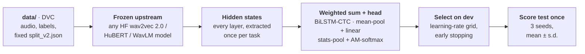

<div align="center">

# SLSB: Sinhala & Lankan-Tamil Speech Benchmark

**A frozen-upstream, SUPERB-style benchmark for self-supervised speech models on Sinhala and Sri Lankan Tamil.**<br>
Ten tasks across six families, leak-checked splits, standard downstream heads, and model selection on dev.

[](#installation)
[](#installation)
[](docs/protocol.md)
[](docs/data.md)
[](LICENSE)

[Tasks](#tasks) · [Protocol](#protocol) · [Results](#results) · [Quick start](#quick-start) · [Repository layout](#repository-layout) · [Documentation](#documentation) · [Limitations](#limitations) · [Changelog](CHANGELOG.md) · [Citation](#citation) · [License](#license)

</div>

---

SLSB measures what a speech encoder's representations already know about Sinhala and Tamil.
The encoder (the *upstream*) is always frozen. For each task, only a learned weighted sum over
its layers and a small standard head are trained, chosen on a dev set and scored once on a
held-out test set. Any Hugging Face wav2vec 2.0, HuBERT or WavLM-style checkpoint, or a local
copy of one, can be benchmarked with a single command.

- **Ten tasks, six families:** speech recognition, emotion recognition, speaker
  identification, speaker verification, speaker diarization, and intent classification.
- **Splits that don't leak.** Every split is fixed data, disjoint by speaker or recording
  where the data allows, and checked automatically so that no identical audio appears in
  both training and test.
- **Standard heads, selected on dev.** SUPERB's downstream heads, with learning rate and
  stopping epoch chosen on a dev set. Each task runs with 3 seeds and reports mean ± s.d.
- **Every run is traceable.** Results go to a CSV table, a JSON summary and, optionally,
  MLflow on DagsHub, tagged with the protocol version and the hyperparameters each head
  settled on.

## Tasks

<picture>
  <source media="(prefers-color-scheme: dark)" srcset="docs/assets/fig1-tasks-dark.png">
  
</picture>

<table>
  <thead>
    <tr><th align="left">Task</th><th align="left">Language</th><th align="left">Corpus</th><th>Speakers</th><th align="left">Disjoint by</th><th align="left">Metric</th></tr>
  </thead>
  <tbody>
    <tr><td colspan="6"><b>Speech recognition (ASR)</b></td></tr>
    <tr><td><code>asr_sinhala</code></td><td>Sinhala</td><td>OpenSLR-52</td><td align="center">478</td><td>speaker</td><td>WER · CER</td></tr>
    <tr><td><code>asr_tamil</code></td><td>Tamil</td><td>TaLK</td><td align="center">22</td><td>speaker</td><td>WER · CER</td></tr>
    <tr><td colspan="6"><b>Emotion recognition (ER)</b></td></tr>
    <tr><td><code>er_tamil</code></td><td>Tamil</td><td>EmoTa</td><td align="center">22</td><td>speaker · 5-fold</td><td>Acc · F1</td></tr>
    <tr><td colspan="6"><b>Speaker identification (SID)</b></td></tr>
    <tr><td><code>sid</code></td><td>Tamil</td><td>SLCeleb</td><td align="center">40</td><td>video</td><td>Acc · F1</td></tr>
    <tr><td colspan="6"><b>Speaker verification (ASV)</b></td></tr>
    <tr><td><code>asv_tamil</code></td><td>Tamil</td><td>SLCeleb</td><td align="center">89 + 40</td><td>speaker</td><td>EER</td></tr>
    <tr><td colspan="6"><b>Speaker diarization (SD)</b></td></tr>
    <tr><td><code>sd_sinhala</code></td><td>Sinhala</td><td>SiTa</td><td align="center">1–10</td><td>recording</td><td>DER</td></tr>
    <tr><td><code>sd_tamil</code></td><td>Tamil</td><td>SiTa</td><td align="center">2–6</td><td>recording</td><td>DER</td></tr>
    <tr><td colspan="6"><b>Intent classification (IC)</b></td></tr>
    <tr><td><code>ic_banking_sinhala</code></td><td>Sinhala</td><td>Banking</td><td align="center">–</td><td>sentence · 5-fold</td><td>Acc · F1</td></tr>
    <tr><td><code>ic_banking_tamil</code></td><td>Tamil</td><td>Banking</td><td align="center">40</td><td>sentence · 5-fold</td><td>Acc · F1</td></tr>
    <tr><td><code>ic_health_tamil</code></td><td>Tamil</td><td>Health</td><td align="center">100</td><td>sentence · 5-fold</td><td>Acc · F1</td></tr>
  </tbody>
</table>

<sub><b>Disjoint by</b>: no test item shares this with training (a speaker, a source video, a recording or a read sentence). Diarization counts speakers per recording; verification trains on 89 speakers and is tested on 40 others. Acc = accuracy, F1 = macro-F1. Clips and hours per task are in the chart above.</sub>

Dataset sources, licences and per-task details are in **[docs/tasks.md](docs/tasks.md)**.
Three tasks in `data/` are not run, each for a data-quality reason; see
[Limitations](#limitations).

## Protocol



Every hidden state is layer-normed over its features before the weighted sum (since v0.3),
so layers with a large scale cannot dominate the mix regardless of what they encode.

| Task family | Downstream head | Selected on |
|---|---|---|
| ASR | weighted sum + 2-layer BiLSTM (1024 per direction) + CTC over characters, greedy decoding | dev CER |
| Emotion, speaker ID, intent | weighted sum + mean-pool + linear | dev accuracy |
| Speaker verification | weighted sum + mean/std statistics pooling + linear embedding, AM-softmax; cosine scoring | dev EER |
| Speaker diarization | the verification head, trained on single-speaker stretches; windows clustered per recording, number of speakers never given | dev DER |

The heads follow SUPERB, with two documented exceptions. Speaker verification uses
statistics pooling rather than an x-vector, because it was clearly better on dev with only
89 training speakers. Its layer mix is also fixed before training, because storing every
layer's frames for its 45 h of training audio would not fit on disk. Diarization takes
speech regions from the reference annotations, so it measures speaker discrimination
rather than speech detection.

The full protocol is in **[docs/protocol.md](docs/protocol.md)**: splits, model selection,
seeds, feature caching, hyperparameters and leakage checks.

## Results

Ten upstreams under protocol v0.5: five public checkpoints, and the same five after continued
pre-training on 200 h of Sinhala and Tamil
([Model-Training-Pipeline](https://github.com/EchoVerge-Labs/Model-Training-Pipeline)).
Each value is the mean over 3 seeds, in percent; **bold** marks the best in each column.

<table>
  <thead>
    <tr>
      <th rowspan="2" align="left">Upstream</th>
      <th colspan="2">ASR ↓</th>
      <th>ER ↑</th>
      <th>SID ↑</th>
      <th>ASV ↓</th>
      <th colspan="2">SD ↓</th>
      <th colspan="3">IC ↑</th>
    </tr>
    <tr>
      <th>Si</th>
      <th>Ta</th>
      <th>Ta</th>
      <th>Ta</th>
      <th>Ta</th>
      <th>Si</th>
      <th>Ta</th>
      <th>Bank<br>Si</th>
      <th>Bank<br>Ta</th>
      <th>Health<br>Ta</th>
    </tr>
  </thead>
  <tbody>
    <tr><td colspan="11"><b>Pre-trained checkpoints</b></td></tr>
    <tr><td>XLS-R&nbsp;300M</td><td align="center">67.0</td><td align="center">81.3</td><td align="center">40.5</td><td align="center"><b>88.5</b></td><td align="center"><b>13.1</b></td><td align="center">7.3</td><td align="center">4.5</td><td align="center">90.8</td><td align="center">59.4</td><td align="center">31.9</td></tr>
    <tr><td>mHuBERT-147</td><td align="center">62.8</td><td align="center">80.1</td><td align="center">40.6</td><td align="center">74.1</td><td align="center">19.6</td><td align="center">11.3</td><td align="center">14.2</td><td align="center">91.5</td><td align="center">63.4</td><td align="center">38.9</td></tr>
    <tr><td>WavLM&nbsp;Large</td><td align="center">67.7</td><td align="center">79.1</td><td align="center">39.8</td><td align="center">84.1</td><td align="center">16.6</td><td align="center">7.7</td><td align="center">4.9</td><td align="center">90.5</td><td align="center">67.2</td><td align="center">40.9</td></tr>
    <tr><td>wav2vec&nbsp;2.0&nbsp;Large</td><td align="center">72.0</td><td align="center">89.4</td><td align="center">38.4</td><td align="center">79.4</td><td align="center">18.1</td><td align="center">9.1</td><td align="center">8.0</td><td align="center">88.3</td><td align="center">58.2</td><td align="center">32.2</td></tr>
    <tr><td>HuBERT&nbsp;Large</td><td align="center">69.8</td><td align="center">84.0</td><td align="center"><b>43.1</b></td><td align="center">79.8</td><td align="center">17.4</td><td align="center">8.1</td><td align="center">6.0</td><td align="center">89.6</td><td align="center"><b>72.3</b></td><td align="center">41.3</td></tr>
    <tr><td colspan="11"><b>After continued pre-training on 200 h of Sinhala and Tamil</b></td></tr>
    <tr><td>XLS-R&nbsp;300M</td><td align="center">61.2</td><td align="center">80.0</td><td align="center">41.1</td><td align="center">87.6</td><td align="center">14.3</td><td align="center">7.0</td><td align="center"><b>2.6</b></td><td align="center">89.6</td><td align="center">60.1</td><td align="center">34.6</td></tr>
    <tr><td>mHuBERT-147</td><td align="center"><b>58.4</b></td><td align="center">78.6</td><td align="center">39.7</td><td align="center">73.8</td><td align="center">20.1</td><td align="center">15.3</td><td align="center">14.3</td><td align="center">92.1</td><td align="center">71.1</td><td align="center"><b>46.4</b></td></tr>
    <tr><td>WavLM&nbsp;Large</td><td align="center">60.3</td><td align="center"><b>74.8</b></td><td align="center">41.8</td><td align="center">81.2</td><td align="center">14.7</td><td align="center"><b>6.4</b></td><td align="center">5.0</td><td align="center"><b>92.4</b></td><td align="center">69.8</td><td align="center">43.8</td></tr>
    <tr><td>wav2vec&nbsp;2.0&nbsp;Large</td><td align="center">68.7</td><td align="center">85.3</td><td align="center">38.3</td><td align="center">77.7</td><td align="center">17.5</td><td align="center">8.8</td><td align="center">11.1</td><td align="center">86.6</td><td align="center">57.5</td><td align="center">31.9</td></tr>
    <tr><td>HuBERT&nbsp;Large</td><td align="center">66.0</td><td align="center">81.8</td><td align="center">39.9</td><td align="center">83.9</td><td align="center">17.8</td><td align="center">7.0</td><td align="center">6.2</td><td align="center">88.7</td><td align="center">70.8</td><td align="center">39.6</td></tr>
  </tbody>
</table>

<sub>ASR: word error rate. ER, SID, IC: accuracy (IC: mean over 5 sentence-disjoint folds). ASV: equal error
rate. SD: diarization error rate. ↓ lower is better, ↑ higher is better. Si = Sinhala, Ta = Tamil;
Bank and Health are the banking and health intent sets.</sub>

- **Continued pre-training lowers ASR WER for all five upstreams**, in both languages
  (Sinhala by 3–7 points, Tamil by 1–4).
- **Elsewhere its effect depends on the upstream.** mHuBERT-147 gains most on Tamil intent
  (about 8 points on both tasks), while HuBERT Large and wav2vec 2.0 Large lose a little.
- **XLS-R 300M is the strongest speaker model** (identification and verification), both
  before and after continued pre-training.

Standard deviations, CER and macro-F1, a per-seed reference run and the per-protocol
comparability rules are in **[docs/results.md](docs/results.md)**; the numbers above are read
from [`docs/results/leaderboard_v0.5.csv`](docs/results/leaderboard_v0.5.csv), and every run is
in the [`slsb-v0.5` experiment on DagsHub](https://dagshub.com/EchoVerge-LABS/SLSB-benchmark/experiments).
Scores from different protocol versions are not comparable.

## Quick start

### Installation

```bash
pip install git+https://github.com/EchoVerge-Labs/SLSB-benchmark.git@v0.5.0
# or, from a clone, with test and lint tools
pip install -e ".[dev]"
```

Install a `torch` / `torchaudio` pair that matches your CUDA version first if pip's default
wheels don't.

### Data

`data/` is versioned with DVC on DagsHub (about 11 GB):

```bash
git clone git@github.com:EchoVerge-Labs/SLSB-benchmark.git && cd SLSB-benchmark
dvc pull
```

How each task was built from its source, and how to rebuild it, is in
[docs/data.md](docs/data.md).

### Benchmark a model

```bash
slsb run --upstream facebook/wav2vec2-xls-r-300m \
         --tasks asr,er,sid,asv,sd,ic \
         --seeds 0,1,2 \
         --data-dir data --params params.yaml \
         --out results/xlsr300m
```

`--upstream` takes any Hugging Face repo id, a local checkpoint directory, or one of the
aliases `xlsr`, `mhubert147` and `wavlm_large`. A full run of all ten tasks takes about
3 hours for a 300M-parameter model on a single GPU. Outputs:

| File | Contents |
|---|---|
| `<out>/benchmark_table.csv` | one row per task, metric and seed |
| `<out>/results_<upstream>.json` | structured summary: metrics, timings, and the learning rate, best epoch and dev score each head settled on |
| `<out>/run.log` | the run's console output |

For a quick end-to-end check, `SLSB_EPOCHS_OVERRIDE=2` caps every head at two epochs.

### Log results to DagsHub

Finished runs are logged **after** they complete, one MLflow run per model, to the
[`slsb-<protocol>` experiment](https://dagshub.com/EchoVerge-LABS/SLSB-benchmark/experiments)
of this repository. Every task's mean and s.d. over seeds becomes a column, so the
experiment table is the comparison table:

```bash
export DAGSHUB_USER=<user> DAGSHUB_TOKEN=<token>
python scripts/log_results.py results/v0.5/wavlm_large \
    --name wavlm-large --kind frozen --family wavlm --base-model microsoft/wavlm-large
python scripts/log_results.py results/v0.5/xlsr300m_copt200h_norm \
    --name xlsr300m-copt200h-norm --kind adapted --family xlsr \
    --base-model facebook/wav2vec2-xls-r-300m --checkpoint 9000 --pretrain-hours 200
```

A model already logged under a protocol is refused unless `--replace` is given. Prefer this
over `slsb run --mlflow-uri`, which logs one run per task and seed.

**Moving a model to the next protocol** needs only a re-run of the tasks it changed;
`--carry-over` copies the other tasks from the model's run under the previous protocol.
v0.4 changed only speaker ID (carried over from `slsb-v0.3`), v0.5 only the three intent
tasks (carried over from `slsb-v0.4`, so log v0.4 first):

```bash
slsb run --upstream <model> --tasks ic --seeds 0,1,2 --data-dir data --params params.yaml \
         --out results/v0.5/<folder>_ic
python scripts/log_results.py results/v0.5/<folder>_ic --carry-over \
    --name <same name as in slsb-v0.4> --kind ... --family ... --base-model ...
```

## Repository layout

```
.
├── src/slsb/
│   ├── cli.py, runner.py      # `slsb run`: load the upstream, run every task × seed, log results
│   ├── features.py            # one-off extraction and caching of frozen hidden states
│   ├── tasks/                 # one module per family: asr, emotion, sid, speaker_verification,
│   │                          #   speaker_diarization, intent; shared heads in _common.py
│   ├── upstream/              # Hugging Face upstream loader
│   ├── metrics/, utils/       # WER/CER/EER/accuracy, datasets and splits, MLflow logging
├── data_prep/                 # builds data/ from each source; make_splits.py writes split_v2.json
├── data.dvc                   # pointer to the versioned data/ on DagsHub
├── params.yaml                # upstream + downstream-head hyperparameters (the v0.5 protocol)
├── configs/tasks/             # one card per task family
├── docs/                      # protocol, tasks, data, results; figures and their source CSVs
├── tests/                     # unit and protocol tests (no GPU, data or network needed)
├── KNOWN_ISSUES.md, CHANGELOG.md
├── CITATION.cff
└── LICENSE
```

`data/` and `results/` are not in git; `data/` is in DVC.

## Documentation

| Document | Contents |
|---|---|
| [Protocol](docs/protocol.md) | Splits, heads, model selection, seeds, feature caching, hyperparameters, leakage checks |
| [Tasks](docs/tasks.md) | Every task: source corpus, licence, size, split, metric and caveats |
| [Data](docs/data.md) | Getting the data, rebuilding it from source, and the integrity checks |
| [Results](docs/results.md) | The leaderboard's sources, a per-seed reference run, comparability across protocol versions, and how to regenerate the figures |
| [SLCeleb data issues](docs/slceleb_data_issues.md) | The duplicated Sinhala audio in SLCeleb, with a reproduction script |
| [Known issues](KNOWN_ISSUES.md) | Exclusions and caveats, task by task |
| [Changelog](CHANGELOG.md) | What changed between versions, and why v0.1 scores are not comparable |

## Limitations

- **Sinhala speaker tasks are missing.** SLCeleb's Sinhala test set is 1,064 recordings
  copied under 39 speaker IDs, and its Sinhala dev set copies the same audio. So speaker
  verification is Tamil-only, and speaker identification covers the 40 Tamil speakers
  ([details](docs/slceleb_data_issues.md)).
- **Three tasks in `data/` are not run:** `asv_sinhala` (above), `asr_omni_sinhala` (a
  single speaker, so no speaker-disjoint split) and `er_sinhala` (broken source metadata).
- **Several test sets are small:** Tamil diarization has 5 test recordings, and Tamil ASR
  has 5 test speakers. Their scores move more between seeds and between models.
- **Intent test sets are unseen sentences, not unseen speakers.** Since v0.5 every intent
  fold holds out whole prompts, so the same person can read in train and test
  (`ic_banking_sinhala` records no speakers at all).
- **No pre-training contamination check yet.** Nothing verifies that an upstream never
  saw a test clip during pre-training. SLCeleb is YouTube audio, so YouTube-based
  pre-training corpora could overlap with it.
- **Diarization uses oracle speech regions,** so its DER isn't comparable with systems
  that detect speech themselves.

## Acknowledgements

SLSB builds on the [SUPERB](https://superbbenchmark.org/) protocol and on the public
corpora listed in [docs/tasks.md](docs/tasks.md): OpenSLR-52, TaLK,
[EmoTa](https://github.com/aaivu/EmoTa), SLCeleb, SiTa, and the Sinhala and Tamil banking
and health intent datasets. Each corpus keeps its own
licence; check [docs/tasks.md](docs/tasks.md) before redistributing any part of `data/`.

## Citation

If you use SLSB or its results, please cite the repository. Citation metadata is in
[`CITATION.cff`](CITATION.cff), and GitHub's **Cite this repository** button produces APA
and BibTeX from it.

```bibtex
@software{slsb_benchmark,
  author  = {M. H. M. Anas and M. I. F. Ifadha and V. D. W. Muthumala and
             S. A. Talagala and Uthayasanker Thayasivam},
  title   = {{SLSB}: {Sinhala} \& {Lankan-Tamil} Speech Benchmark},
  url     = {https://github.com/EchoVerge-Labs/SLSB-benchmark},
  version = {0.5.0},
  year    = {2026}
}
```

Please also cite the corpora behind the tasks you report; [docs/tasks.md](docs/tasks.md)
links each one.

## License

The code in this repository is released under the [MIT License](LICENSE).

The corpora in `data/` are not covered by it and keep their own licences, listed in
[docs/tasks.md](docs/tasks.md).

---

<sub>EchoVerge Labs · Department of Computer Science and Engineering, University of Moratuwa, Sri Lanka.</sub>
