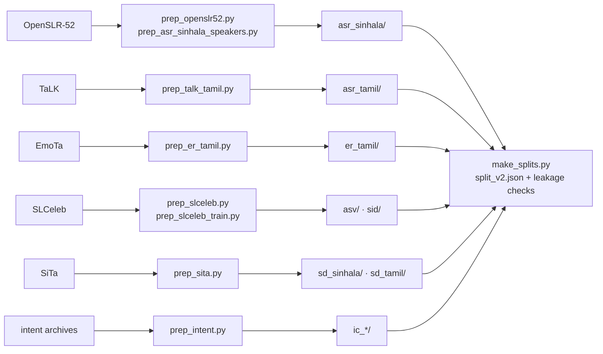

# Data

## Getting the data

`data/` is versioned with [DVC](https://dvc.org) on DagsHub, about 11 GB and 37,600 files.
Each git tag pins the matching data version through `data.dvc`.

```bash
git clone git@github.com:EchoVerge-Labs/SLSB-benchmark.git && cd SLSB-benchmark
git checkout v0.2.0
dvc pull
```

DVC reads its DagsHub credentials from `.dvc/config.local`, which is not committed.

## Layout

The runner discovers tasks from the folder layout, so adding a folder with a known label
file adds a task without code changes.

| Folder | Label file | Kind |
|---|---|---|
| `asr_<lang>/` | `transcripts.csv` (`filename,transcript`), optional `speakers.csv` | ASR |
| `<task>_<lang>/` or `sid/` | `labels.csv` (`filename,label`), optional `speakers.csv` | classification |
| `asv/` | `trials_<lang>.csv` (`label,wav1,wav2`), plus `train_labels.csv` and `train_audio/` for training | verification |
| `sd_<lang>/` | `<recording>.wav` + `<recording>.rttm` pairs | diarization |

Each folder holds its audio in `audio/` (16 kHz mono PCM), unless an `audio_dir.txt` points
elsewhere (`sid/` uses `asv/audio/`). It also holds `split_v2.json`, the fixed partition the
protocol uses.

## Rebuilding from source

The scripts in [`data_prep/`](../data_prep) build each folder from its source corpus. Each
documents its inputs in its docstring; some need a manually placed archive or a Hugging
Face token. All of them are idempotent.



```bash
python data_prep/prep_openslr52.py
python data_prep/prep_asr_sinhala_speakers.py
python data_prep/prep_talk_tamil.py
python data_prep/prep_er_tamil.py              # needs HF_TOKEN with EmoTa's terms accepted
python data_prep/prep_slceleb.py               # needs data_prep/downloads/slceleb.zip + trial lists
python data_prep/prep_slceleb_train.py
python data_prep/prep_sita.py                  # needs the SiTa archive
python data_prep/prep_intent.py                # needs data_prep/downloads/intent/
python data_prep/make_splits.py
```

After a rebuild, `dvc add data && dvc push` records and uploads the new version.

## Integrity checks

[`make_splits.py`](../data_prep/make_splits.py) compares audio by its decoded 16-bit samples,
so differing file headers can't hide a duplicate. It **fails** if:

- identical audio lands in more than one part of a task's split (train / dev / test, or two
  folds);
- a speaker-verification training clip is identical to a clip used by the trials.

Speaker-disjointness is asserted for every ASR split and every k-fold split; the ASV
train and dev speakers are disjoint by construction. The checks found the SLCeleb problems described in
[slceleb_data_issues.md](slceleb_data_issues.md); the prep scripts now remove them.
