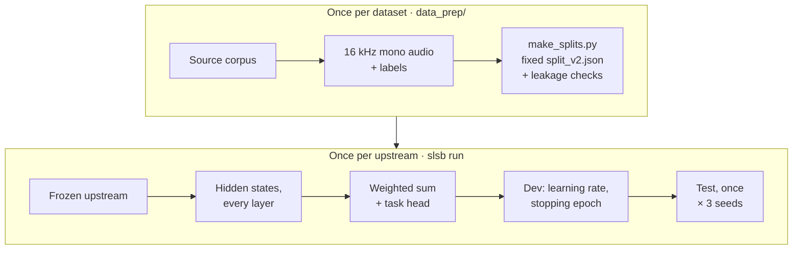

# Protocol (v0.2)

How SLSB turns a frozen encoder into a set of scores. Everything here is implemented in
[`src/slsb/`](../src/slsb), and every hyperparameter lives in [`params.yaml`](../params.yaml).
Scores from different protocol versions are not comparable; every result records
`protocol` and `slsb_version`.

## 1. The upstream is frozen

The upstream is loaded with Hugging Face `AutoModel`, in evaluation mode, with gradients
disabled. Its feature extractor's own settings apply, including `do_normalize`. A task sees
the hidden states of **every** layer, from the CNN output through the last transformer
layer. A learned softmax-weighted sum over those layers is the first part of every head, as
in SUPERB.

Because the upstream never changes, its hidden states are identical in every epoch,
learning-rate trial and seed. So SLSB extracts them **once per task**, caches them under
`<out>/.features/` (deleted when the task finishes), and trains every head on the cache.

- **Utterance-level tasks** (emotion, speaker ID, intent) store each clip's per-layer mean
  over frames. This is exact for a mean-pool head, because mean-pooling commutes with the
  weighted sum.
- **ASR** stores every layer's frames.
- **Speaker verification and diarization** store one fixed mix of layers per frame
  (see §3), because all layers would not fit on disk.

Clips longer than 20 s are cropped for utterance-level tasks. ASR audio is never cropped,
since that would desync it from its transcript. Diarization recordings, which run up to
17 minutes, go through the upstream in 30-second chunks.

## 2. Splits are data

Every task's partition is a file, `data/<task>/split_v2.json`, written once by
[`data_prep/make_splits.py`](../data_prep/make_splits.py) with a fixed seed and versioned
with the data. Every upstream and every run seed uses the same partition.

| Task | Partition | Rule |
|---|---|---|
| ASR | train / dev / test, 70 / 10 / 20 | speaker-disjoint. `asr_sinhala`'s speakers come from OpenSLR-52's `utt_spk_text.tsv`; `asr_tamil`'s v0.1 test set is kept because it was already speaker-disjoint |
| Emotion, intent with speakers | 5 folds | speaker-disjoint. For fold *k*: test = fold *k*, dev = fold *k*+1, train = the rest; reported as the mean over folds |
| Intent without speakers | train / dev / test | stratified random (`ic_banking_sinhala`, flagged `random_stratified_no_speaker_ids`) |
| Speaker identification | train / dev / test | closed set: every speaker is a class, stratified |
| Speaker verification | trial list = test | trained on SLCeleb dev speakers, none of them in the trials; dev trials (5,400, balanced) come from 9 held-out training speakers |
| Speaker diarization | train / dev / test, 40 / 20 / 40 | recording-disjoint |

**Leakage checks.** `make_splits.py` refuses to write a split if:
- identical audio, compared by decoded 16-bit samples so that differing file headers can't
  hide a match, lands in more than one part (train / dev / test, or two folds);
- any speaker-verification training clip is identical to a clip the trials use.

Classification tasks also keep one copy of repeated audio, and drop any audio filed under
two different labels.

## 3. Heads

| Family | Head | Loss | Notes |
|---|---|---|---|
| ASR | weighted sum → 2-layer BiLSTM, 1024 units per direction, dropout 0.2 → linear | CTC over characters | greedy decoding, no language model; gradient clipping 1.0 |
| Emotion, speaker ID, intent | weighted sum → mean-pool → linear | cross-entropy | SUPERB's utterance-level head |
| Speaker verification | weighted sum (fixed) → mean + std statistics pooling → 256-d linear embedding | AM-softmax, margin 0.4, scale 30 | 4 s random training crops; cosine scoring of whole clips |
| Speaker diarization | as speaker verification, trained on single-speaker stretches of the training recordings | AM-softmax | see §5 |

**Speaker verification departs from SUPERB twice.**

1. **Statistics pooling instead of an x-vector.** The choice was made on dev EER, over 3
   seeds, on the 80-speaker Tamil training set. Test EER was never used to choose.

   | Head | Dev EER |
   |---|---|
   | **Statistics pooling (chosen)** | **0.123 ± 0.003** |
   | x-vector, AM-softmax margin 0.2 | 0.142 |
   | x-vector, learning rate 1e-4 | 0.146 |
   | statistics pooling + dropout / weight decay | 0.155 |
   | x-vector (SUPERB's setting) | 0.163 |
   | small x-vector + dropout / weight decay | 0.186 |
   | no training (mean-pooled features) | 0.380 |

   With few training speakers the x-vectors peak within 3–6 epochs, while statistics
   pooling keeps improving for about 13. Setting `head: xvector` in `params.yaml` restores
   the x-vector.

2. **The layer mix is fixed first.** A mean-pool speaker classifier is trained on up to 30
   clips per training speaker, and its layer weights are used to store a single mixed frame
   sequence per clip. SUPERB learns these weights jointly with the head; here, storing
   every layer's frames for 45 h of audio would take hundreds of GB.

## 4. Model selection and seeds

- **Selection on dev.** Each head trains once per learning rate in its grid
  (`params.yaml`: `lr_grid`), one epoch at a time, keeping the weights from the epoch with
  the best dev score. It stops after `patience` epochs without improvement. The best dev
  score over all learning rates wins.
- **The grid is searched on the first seed only.** Later seeds reuse the learning rate it
  picked.
- **The test set is scored once,** with the selected weights.
- **Seeds** (default 0, 1, 2) set the head's initialisation, batch order and training
  crops. They never change the splits. Results are reported as mean ± sample s.d. over
  seeds.

| Family | Learning-rate grid | Max epochs | Patience | Batch |
|---|---|---|---|---|
| ASR | 1e-3, 1e-4 | 60 | 8 | ≤ 32 clips, ≤ 12,000 padded frames |
| Emotion, speaker ID, intent | 1e-2, 1e-3, 1e-4 | 200 | 20 | 32 |
| Speaker verification | 1e-3, 1e-4 | 40 | 6 | 64 crops of 4 s |
| Speaker diarization | 1e-3, 1e-4 | 30 | 5 | 64 windows of 1.5 s |

`SLSB_EPOCHS_OVERRIDE=N` caps every `max_epochs` for quick checks, without editing
`params.yaml`.

## 5. Speaker diarization

1. **Speech regions** come from the reference RTTM (oracle speech activity). Turns are
   clipped to the length of the audio.
2. **The embedding head** trains on single-speaker stretches of the training recordings of
   both languages, cut into 1.5 s windows; each recording's speakers are separate classes.
3. **Each dev or test recording** is cut into 1.5 s windows with a 0.75 s hop over its
   speech. The windows are embedded, then clustered with agglomerative clustering (average
   linkage, cosine distance). Each window labels the stretch of timeline nearest its centre.
4. **The number of speakers is never given.** The distance threshold is chosen from a
   20-point grid on each language's dev recordings, and the head is early-stopped on the
   pooled dev DER.
5. **DER** is computed with `pyannote.metrics`, with a 0.25 s collar and overlapped speech
   included. Missed speech, false alarm and speaker confusion are logged separately.

With oracle speech regions, false alarm is zero, and missed speech is only the overlapped
speech a single-label clustering can't cover (about 1% of speech). DER here is essentially
speaker confusion.

## 6. Logging

Each (task, seed) run writes one row per metric to `<out>/benchmark_table.csv`, and an entry
to `<out>/results_<upstream>.json` with the metrics, timings, split type and the head's
details: learning rate, best epoch and dev score, plus per-fold accuracies for k-fold tasks
and the layer weights for speaker tasks. With `--mlflow-uri` and `DAGSHUB_TOKEN`, the same
is logged to MLflow, with the details as `probe_*` parameters.
